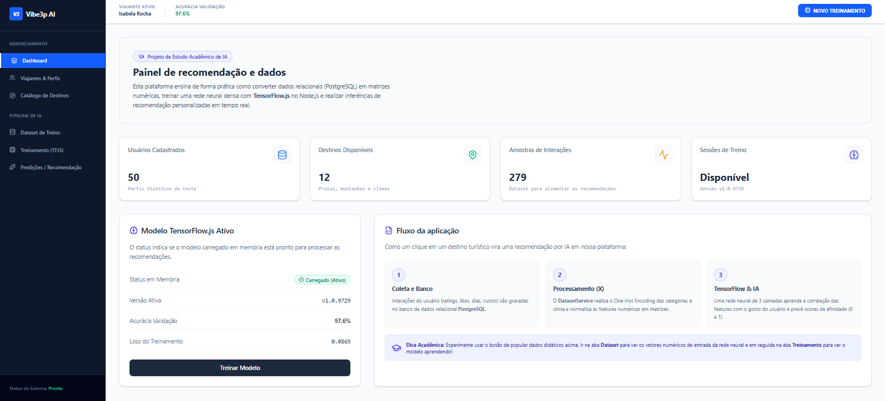
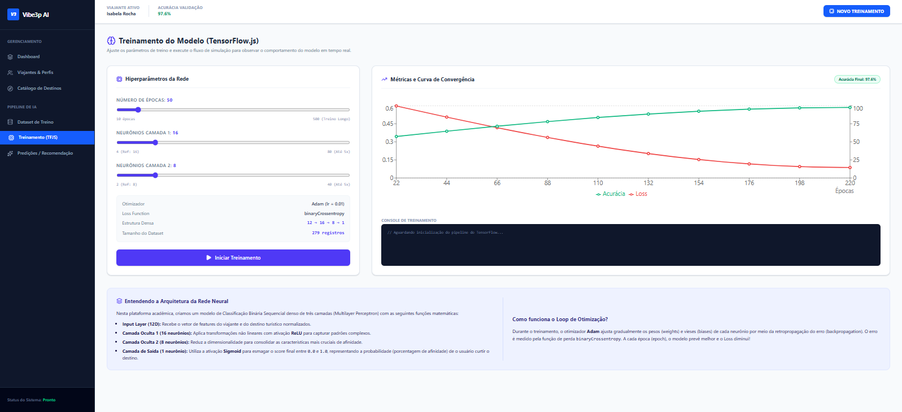

# Vibe3p AI - Plataforma Acadêmica de Recomendação com TensorFlow.js

Este é o **Vibe3p AI**, uma plataforma de estudo de aprendizado de máquina em tempo real utilizando **TensorFlow.js** integrado a um banco de dados relacional **PostgreSQL** (com Drizzle ORM). 

O sistema foi estruturado de forma didática para demonstrar o fluxo completo de um pipeline de recomendação:
1. **Banco de Dados Relacional**: Armazenamento e gerenciamento de perfis de usuários, destinos turísticos e histórico de comportamento (interações) no PostgreSQL.
2. **Pré-processamento de Dados**: Extração de dados relacionais e conversão em vetores de características (*features*) normalizados (escala `[0, 1]`) com codificação *One-Hot* para categorias de clima e classificação de destinos.
3. **Treinamento Síncrono de Rede Neural**: Compilação de um modelo sequencial (*Multilayer Perceptron*) no TensorFlow.js para calibrar os pesos dos neurônios com base no comportamento do usuário.
4. **Inferência / Predições**: Cálculo de pontuações de afinidade em tempo real para propor os top destinos mais aderentes ao perfil de cada viajante.


---

## 🛠️ Requisitos de Ambiente (WSL / Docker)

A aplicação foi preparada para rodar de forma totalmente containerizada através do **Docker Compose**.

- **Host WSL2** (Ubuntu/Debian recomendado no Windows)
- **Docker Engine** e **Docker Compose** (instalação nativa WSL ou Docker Desktop com integração WSL2 habilitada)
- *Opcional*: Node.js v20+ caso queira executar o projeto fora de containers.

---

## 🚀 Passo a Passo: Implantação Local em Containers (Docker Compose)

Siga os passos abaixo após baixar ou clonar o repositório no seu ambiente WSL:

### 1. Acessar o Diretório do Repositório
No seu terminal WSL, navegue até a pasta raiz do projeto:
```bash
cd vibe3p-ai
```

### 2. Configurar as Variáveis de Ambiente
Crie o arquivo `.env` na raiz do projeto com as credenciais padrão já configuradas para os containers Docker:

```bash
cp .env.example .env
```

O arquivo `.env` para o ambiente Docker Compose conterá:
```env
SQL_HOST=postgres
SQL_USER=postgres
SQL_PASSWORD=postgres_password
SQL_DB_NAME=vibe3p_db
SQL_ADMIN_USER=postgres
SQL_ADMIN_PASSWORD=postgres_password
PORT=3000
NODE_ENV=production
```
### 2.1 Instalar dependencias
npm install


### 3. Subir os Containers (Aplicação + Banco PostgreSQL)
Execute o Docker Compose para compilar a imagem da aplicação e iniciar o container do PostgreSQL 16 Alpine:

```bash
docker compose up -d --build
```

*Isso iniciará dois serviços:*
- `vibe3p-db`: Container PostgreSQL escutando na porta `5432` com volume de dados persistente (`postgres_data`).
- `vibe3p-app`: Container da aplicação Node.js / Express escutando na porta `3000`.

### 4. Sincronizar o Schema do Banco de Dados (Drizzle ORM)
Após os containers estarem rodando e saudáveis, execute a sincronização de tabelas dentro do container da aplicação:

```bash

npx drizzle-kit push --config=src/db/drizzle.config.ts

```
*Este comando criará automaticamente as tabelas `users`, `destinations` e `user_interactions` no banco PostgreSQL containerizado.*

### 5. Popular o Banco com Dados Didáticos (Seed Autônomo)
Ainda via Docker, preencha o banco com 50 perfis de viajantes sintéticos, destinos e centenas de avaliações:

```bash

npx tsx src/db/seed.ts
```

### 6. Acessar a Aplicação
Abra o seu navegador no Windows/WSL no endereço:
```text
http://localhost:3000
```

---

## 📄 Arquivos de Réplica de Segurança (.txt)

Para previr eventuais falhas de leitura, permissões de arquivo ou corrupção na cópia do repositório, mantemos cópias idênticas em formato `.txt` dos arquivos de configuração Docker na raiz do projeto:

- `Dockerfile` $\rightarrow$ Réplica: `Dockerfile.txt`
- `docker-compose.yml` $\rightarrow$ Réplica: `docker-compose.yml.txt`
- `.dockerignore` $\rightarrow$ Réplica: `.dockerignore.txt`

Caso precise restaurar qualquer um dos arquivos originais, basta copiá-los:
```bash
cp Dockerfile.txt Dockerfile
cp docker-compose.yml.txt docker-compose.yml
cp .dockerignore.txt .dockerignore
```

---

## 🛠️ Comandos Úteis de Gerenciamento do Container

- **Acompanhar os Logs da Aplicação**:
  ```bash
  docker compose logs -f app
  ```

- **Acompanhar os Logs do Banco de Dados**:
  ```bash
  docker compose logs -f postgres
  ```

- **Parar a Aplicação (Mantendo Dados do Banco)**:
  ```bash
  docker compose stop
  ```

- **Reiniciar os Containers**:
  ```bash
  docker compose restart
  ```

- **Remover Containers e Zerar o Banco de Dados (Reset Completo)**:
  ```bash
  docker compose down -v
  ```

---

## 💻 Opção Alternativa: Execução Nativa (Sem Docker)

Se preferir rodar fora de containers usando o Node.js e PostgreSQL locais instalados no WSL:

```bash
# 1. Instalar dependências
npm install

# 2. Configurar o .env apontando para seu localhost e credenciais locais do PostgreSQL

# 3. Sincronizar tabelas e popular o banco
npx drizzle-kit push
npm run db:seed

# 4. Iniciar servidor em desenvolvimento
npm run dev
```

---

## 💡 Recursos Disponíveis na Interface

- **Dashboard**: Visão panorâmica da quantidade de dados carregados, status do modelo e atalhos didáticos.
- **Viajantes & Perfis**: Permite alternar entre 50 diferentes personas sintéticas de viajantes ou atualizar dados demográficos.
- **Catálogo de Destinos**: Adicione novos destinos para aumentar o escopo de predição do modelo.
- **Dataset de Treino**: Visualize os registros comportamentais crus transformados em tensores de entrada $X$ de 12 dimensões.
- **Treinamento (TFJS)**: Controle os hiperparâmetros (épocas e neurônios das camadas ocultas) através de seletores visuais e treine a rede neural em tempo real.
- **Predições**: Execute a inferência e confira os scores de afinidade e recomendações para o viajante ativo.

